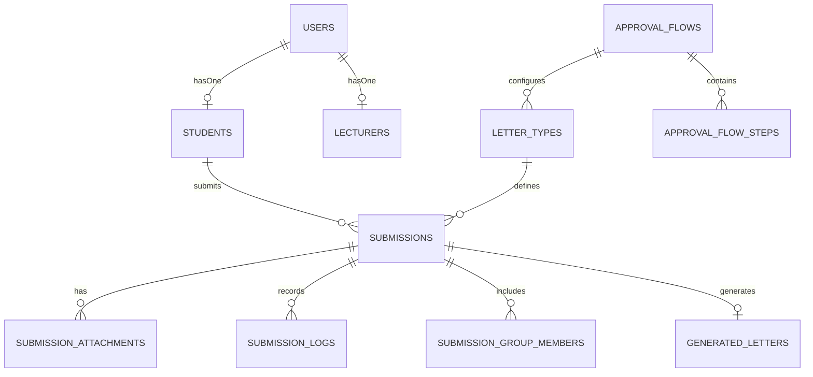

# Dokumentasi Teknis Laporan Tugas Akhir
## Sistem Informasi Pengajuan Dan Monitoring Surat Akademik Mahasiswa Berbasis Web

> **Program Studi D3 Teknik Informatika — Fakultas Ilmu Komputer**  
> **Universitas AMIKOM Yogyakarta**

---

## 🎓 Informasi Tugas Akhir

| Parameter | Spesifikasi Dokumentasi Laporan |
| :--- | :--- |
| **Judul Tugas Akhir** | **Rancang Bangun Sistem Informasi Pengajuan Dan Monitoring Surat Akademik Mahasiswa Berbasis Web** |
| **Program Studi** | D3 Teknik Informatika |
| **Fakultas / Instansi** | Fakultas Ilmu Komputer — Universitas AMIKOM Yogyakarta |
| **Metodologi Pengembangan** | Agile Development |
| **Lingkup Implementasi** | Program Studi D3 Teknik Informatika |
| **Metode Pengujian** | Blackbox Testing |
| **Framework & Stack** | Laravel 12.x (PHP 8.3+), Tailwind CSS, MySQL/SQLite |

---

## 📋 Daftar Isi

1. [Naskah Latar Belakang & Ruang Lingkup Laporan](#1-naskah-latar-belakang--ruang-lingkup-laporan)
2. [Spesifikasi Kebutuhan Fungsional (SRS)](#2-spesifikasi-kebutuhan-fungsional-srs)
3. [Metodologi Pengembangan Agile](#3-metodologi-pengembangan-agile)
4. [Arsitektur Sistem & Pola Desain](#4-arsitektur-sistem--pola-desain)
5. [Skema Database & Model Data (ERD)](#5-skema-database--model-data-erd)
6. [Alur Kerja Pipeline State Machine](#6-alur-kerja-pipeline-state-machine)
7. [Daftar Placeholder Tag Template Surat](#7-daftar-placeholder-tag-template-surat)
8. [Infrastruktur Keamanan & Performance Optimization](#8-infrastruktur-keamanan--performance-optimization)
9. [Matriks Rute & Hak Akses (Route Matrix)](#9-matriks-rute--hak-akses-route-matrix)
10. [Metodologi Pengujian Blackbox Testing](#10-metodologi-pengujian-blackbox-testing)

---

## 1. Naskah Latar Belakang & Ruang Lingkup Laporan

*(Salinan Naskah Bab I Laporan Tugas Akhir)*

Di era transformasi digital saat ini, berbagai organisasi publik maupun swasta dituntut untuk menyediakan layanan administrasi yang cepat, transparan, dan terintegrasi guna mendukung efisiensi operasional. Sebagai contoh, masyarakat kini sudah terbiasa dengan kemudahan aplikasi transportasi online seperti Gojek atau Grab dan platform belanja online yang menyatukan proses pemesanan, pembayaran, hingga pelacakan posisi kurir secara *real-time* dalam satu platform. Di sektor publik pun, masyarakat mulai akrab dengan layanan satu pintu seperti pengurusan dokumen kependudukan atau pembayaran pajak kendaraan secara online. Lingkungan yang dinamis ini memerlukan sistem pengelolaan dokumen modern yang mampu memfasilitasi kebutuhan pengguna secara mandiri. Digitalisasi bukan lagi sekadar pilihan, melainkan sebuah standar baku untuk meningkatkan kualitas pelayanan dan mewujudkan tata kelola yang modern.

Program Studi D3 Teknik Informatika Universitas Amikom Yogyakarta merupakan unit pelaksana akademik yang berfokus pada pendidikan vokasi di bidang teknologi informasi, di mana efisiensi dan adaptasi teknologi seharusnya menjadi pilar utama. Proses bisnis administrasi yang berjalan di program studi ini meliputi berbagai pelayanan hak akademik mahasiswa, salah satunya adalah pengajuan surat-surat resmi seperti **Surat Rekomendasi Magang**, **Surat Persetujuan Tugas Akhir Non-Reguler**, hingga **Surat Rekomendasi Pendadaran**. 

Saat ini, alur proses bisnis pengajuan surat tersebut masih dilakukan melalui platform yang terfragmentasi dan belum terintegrasi ke dalam satu sistem tunggal. Alur operasionalnya masih melibatkan penggunaan media yang terpisah secara manual, proses ini diawali dengan **mahasiswa harus mengisi Google Form** untuk pendataan awal dan mengunggah berkas syarat, kemudian berpindah **membuka website fakultas** untuk memantau status persetujuan, dan akhirnya **menunggu email** untuk pengiriman dokumen hasil dalam bentuk PDF. Kondisi ini menyebabkan ketidakteraturan dalam pengelolaan data karena informasi tersebar di berbagai media, sehingga menimbulkan masalah umum berupa birokrasi yang tidak efisien dan lemahnya sinkronisasi data administrasi antara pihak program studi dan fakultas.

Secara lebih mendalam, terdapat beberapa kendala krusial yang muncul akibat alur yang terpisah tersebut:
1. **Kebingungan Pemantauan Status**: Mahasiswa seringkali mengalami kebingungan dalam memantau perkembangan pengajuan suratnya karena tidak adanya dasbor pemantauan terpusat yang mencakup seluruh tahapan proses.
2. **Kurangnya Transparansi Persetujuan**: Alur persetujuan yang melibatkan berbagai pihak mulai dari program studi hingga fakultas menjadi kurang transparan, sehingga waktu penyelesaian surat sulit untuk diprediksi.

Jika kondisi ini terus dibiarkan, maka risiko terjadinya keterlambatan layanan akan semakin tinggi, beban kerja administratif akan terus meningkat secara tidak efektif, dan pelayanan kepada mahasiswa menjadi kurang optimal.

Sebagai solusi atas permasalahan tersebut, peneliti mengusulkan pembangunan **Sistem Informasi Manajemen Persuratan Terintegrasi Berbasis Web**. Sistem ini dikembangkan menggunakan framework Laravel dengan menerapkan **metode Agile**. Pemilihan metode Agile bertujuan agar pengembangan sistem dapat berlangsung secara adaptif dan responsif terhadap perubahan kebutuhan pengguna selama proses pembangunan. Melalui sistem ini, seluruh proses pengajuan, pemantauan status, hingga pengunduhan surat akan disatukan dalam satu platform. Dengan adanya aplikasi ini, diharapkan proses administrasi menjadi lebih efektif dan transparan, serta mampu memberikan kemudahan akses bagi seluruh civitas akademika di masa mendatang.

---

## 2. Spesifikasi Kebutuhan Fungsional (SRS)

Berikut adalah matriks Kebutuhan Fungsional (*Functional Requirements*) yang dapat disalin langsung untuk **Bab III / Bab IV Laporan TA**:

| Kode SRS | Deskripsi Kebutuhan Fungsional | Role Terkait |
| :--- | :--- | :--- |
| **SKF-01** | Sistem dapat memverifikasi kredensial login pengguna berdasarkan role (`ADMIN`, `LECTURER`, `STUDENT`). | Publik / All |
| **SKF-02** | Sistem dapat menampilkan form pengajuan surat dengan verifikasi prasyarat (IPK, SKS, Lampiran). | Student |
| **SKF-03** | Sistem dapat memproses permohonan surat perorangan maupun permohonan kelompok (*team request*). | Student |
| **SKF-04** | Sistem dapat melakukan pemantauan (*monitoring*) status alur persetujuan surat secara *real-time*. | Student |
| **SKF-05** | Sistem dapat menentukan dosen penelaah secara otomatis (*Approver Resolution*) berdasarkan struktur Dosen Wali, Pembimbing, atau Kaprodi D3 Teknik Informatika. | System |
| **SKF-06** | Sistem dapat menampilkan dashboard dosen berisi statistik permohonan dan antrean persetujuan. | Lecturer |
| **SKF-07** | Sistem dapat memproses persetujuan (*approve*) atau penolakan (*reject*) surat beserta catatan revisi. | Lecturer |
| **SKF-08** | Sistem dapat menerbitkan dokumen PDF otomatis beserta nomor surat dan QR Code unik setelah persetujuan akhir Kaprodi. | System |
| **SKF-09** | Sistem menyediakan halaman publik `/verify/{token}` untuk memeriksa keabsahan surat resmi D3 Teknik Informatika melalui pemindaian QR Code. | Publik |
| **SKF-10** | Admin prodi dapat mengelola jenis surat, alur persetujuan (*Approval Flow*), dan template HTML surat. | Admin |

---

## 3. Metodologi Pengembangan Agile

Pengembangan aplikasi ini menerapkan **Metodologi Agile Development** yang terbagi dalam siklus iterasi (Sprint):

```
┌───────────────────────────────────────────────────────────┐
│                    AGILE DEVELOPMENT                      │
│                                                           │
│  [ Product Backlog ] ──> [ Sprint Planning ]              │
│                                  │                        │
│                                  ▼                        │
│                         [ Sprint Execution ]              │
│                         - Design & Development            │
│                         - Code Refactoring & Security     │
│                         - Daily Integration               │
│                                  │                        │
│                                  ▼                        │
│                         [ Review & Testing ]              │
│                         - Blackbox Testing                │
│                                  │                        │
│                                  ▼                        │
│                       [ Increment Release ]               │
└───────────────────────────────────────────────────────────┘
```

1. **Sprint 1 — Core Architecture & Database Setup**: Analisis kebutuhan prodi D3 Teknik Informatika, perancangan ERD, dan setup kerangka Laravel 12.
2. **Sprint 2 — Student Submission & Monitoring Module**: Pengembangan form pengajuan perorangan/kelompok, pengecekan prasyarat IPK/SKS, serta tampilan monitoring status real-time.
3. **Sprint 3 — Lecturer Multi-Tier Approval Pipeline**: Pengembangan portal dosen/kaprodi untuk persetujuan berjenjang dan catatan revisi.
4. **Sprint 4 — E-Verification, PDF Generator & Refactoring**: Integrasi pencetakan PDF, tanda tangan digital, QR Code verification, serta refactoring keamanan (Path Traversal & BOLA protection).

---

## 4. Arsitektur Sistem & Pola Desain

Aplikasi ini dibangun menggunakan arsitektur **Laravel MVC dengan Service Layer Pattern** untuk memisahkan logika pengontrol (*Controller*), logika bisnis (*Service Layer*), dan pengolahan data (*Eloquent Model*).

```
[ HTTP Request / Route ]
          │
          ▼
   [ Middleware ] ── (RoleMiddleware / Auth)
          │
          ▼
   [ Controller ] ── (FormRequest Validation)
          │
          ▼
    [ Service Layer ]
  ├── ApprovalWorkflowService
  ├── StudentSubmissionService
  ├── LecturerSubmissionService
  ├── LetterPreviewService
  ├── LetterGeneratorService
  └── PdfGenerationService
          │
          ▼
   [ Eloquent Models ] ── [ Database (MySQL / SQLite) ]
```

---

## 5. Skema Database & Model Data (ERD)

### Diagram Relasi Entitas (ERD)



---

## 6. Alur Kerja Pipeline State Machine

Proses pengajuan surat mengikuti alur *State Machine* berikut:

```
 [ DRAFT / SUBMITTED ]
          │
          ▼
    (Assign Approver) ──> [ IN_REVIEW (Step 1: Dosen Wali / Pembimbing) ]
                                  │
                       ┌──────────┴──────────┐
                       ▼                     ▼
                [ Approved ]           [ Rejected ]
                       │                     │
               (Has Next Step?)              ▼
               ┌───────┴───────┐       [ REJECTED ]
              Ya              Tidak
               │               │
               ▼               ▼
      [ IN_REVIEW (Step 2: Kaprodi D3 TI) ]  [ APPROVED / GENERATED ]
                                              (Auto-create GeneratedLetter & QR)
```

---

## 7. Daftar Placeholder Tag Template Surat

Editor template surat pada Portal Admin dapat menggunakan *placeholder tag* berikut untuk menyusun isi dokumen surat D3 Teknik Informatika:

### Data Surat & Mahasiswa
- `{letter_number}`: Nomor resmi surat (atau nomor pratinjau).
- `{student_name}`: Nama lengkap mahasiswa pengaju.
- `{student_number}`: NIM mahasiswa (contoh `22.01.XXXX`).
- `{study_program}`: Program studi (`D3 Teknik Informatika`).
- `{semester}`: Semester berjalan.
- `{gpa}`: IPK mahasiswa.
- `{total_credits}`: Total SKS yang telah ditempuh (misal `92 SKS`).
- `{purpose}`: Keperluan/tujuan pengajuan surat.

### Data Kelompok & Tugas Akhir
- `{group_name}`: Nama tim/kelompok (jika pengajuan kelompok).
- `{group_leader_name}`: Nama ketua kelompok.
- `{group_leader_number}`: NIM ketua kelompok.
- `{group_members}`: Tabel HTML daftar anggota kelompok.
- `{thesis_title}`: Judul Tugas Akhir.

### Data Instansi & Pejabat D3 Teknik Informatika
- `{company_name}`: Nama perusahaan/instansi tujuan magang/riset.
- `{company_address}`: Alamat perusahaan/instansi tujuan.
- `{academic_advisor_name}` / `{academic_advisor_nip}`: Nama & NIP Dosen Wali.
- `{head_of_program_name}` / `{head_of_program_nip}`: Nama & NIP Kaprodi D3 Teknik Informatika.

---

## 8. Infrastruktur Keamanan & Performance Optimization

### Fitur Keamanan
1. **Role-Based Access Control (RBAC)**: Enforcing middleware `role:ADMIN`, `role:STUDENT`, dan `role:LECTURER` pada rute prodi.
2. **Otorisasi Lampiran (BOLA Protection)**: `SubmissionAttachmentPolicy` memastikan hanya mahasiswa pemilik/anggota tim, dosen penelaah, atau admin yang dapat mengunduh berkas lampiran.
3. **Proteksi Path Traversal**: `LetterAssetController` mensanitasi parameter berkas dengan `basename()`, mengecek *whitelist* ekstensi, dan memverifikasi batasan `realpath()`.
4. **Verifikasi QR Token Publik**: Halaman `/verify/{token}` memverifikasi token surat secara tepat tanpa mengekspos ID mentah pengajuan draft.

---

## 9. Matriks Rute & Hak Akses (Route Matrix)

### Rute Publik & Terautentikasi Umum
- `GET /`: Redirect ke halaman login.
- `GET /verify/{token}`: Halaman verifikasi publik keabsahan surat resmi D3 TI.
- `GET /attachments/{attachment}`: Unduh/pratinjau lampiran surat (terlindungi Policy).
- `GET /letter/{filename}`: Asset layout surat statis (terlindungi boundary check).

### Rute Portal Mahasiswa D3 TI (`role:STUDENT`)
- `GET /student/dashboard`: Dashboard mahasiswa & statistik monitoring pengajuan.
- `GET /student/submissions`: Riwayat pengajuan surat.
- `GET /student/submissions/create`: Form pengajuan surat baru.
- `POST /student/submissions`: Proses pembuatan pengajuan surat.
- `GET /student/submissions/{submission}`: JSON detail pengajuan surat.
- `GET /student/submissions/{submission}/preview`: Pratinjau dokumen surat A4.
- `GET /student/submissions/{submission}/download`: Unduh surat resmi berformat PDF.

### Rute Portal Dosen & Kaprodi (`role:LECTURER`)
- `GET /lecturer/dashboard`: Dashboard dosen & daftar tugas persetujuan.
- `GET /lecturer/submissions`: Daftar permohonan surat perlu persetujuan.
- `GET /lecturer/submissions/history`: Riwayat permohonan yang telah diproses.
- `GET /lecturer/submissions/{submission}`: Detail permohonan & pratinjau dokumen.
- `POST /lecturer/submissions/{submission}/approve`: Akses persetujuan permohonan.
- `POST /lecturer/submissions/{submission}/reject`: Akses penolakan permohonan.

---

## 10. Metodologi Pengujian Blackbox Testing

Metode pengujian yang digunakan dalam penyusunan Laporan Tugas Akhir ini adalah **Blackbox Testing**. Pengujian ini berfokus pada verifikasi masukan (*input*) dan keluaran (*output*) antarmuka sistem tanpa menguji alur internal kode program.

### Skenario & Matriks Uji Blackbox

| No | Skenario Pengujian | Masukan (Input) | Hasil yang Diharapkan | Hasil Pengujian |
| :--- | :--- | :--- | :--- | :--- |
| **TP-01** | Login Mahasiswa D3 TI | Username NIM & Password Benar | Berhasil masuk ke Portal Dashboard Mahasiswa | **Valid / Lulus** |
| **TP-02** | Login Dosen / Kaprodi | Username NIP & Password Benar | Berhasil masuk ke Portal Dashboard Dosen | **Valid / Lulus** |
| **TP-03** | Pengajuan Surat Tanpa Lampiran Wajib | Mengosongkan lampiran pada jenis surat wajib lampiran | Sistem menampilkan pesan validasi error | **Valid / Lulus** |
| **TP-04** | Monitoring Status Pengajuan | Membuka halaman riwayat pengajuan surat | Sistem menampilkan progress status alur persetujuan real-time | **Valid / Lulus** |
| **TP-05** | Persetujuan Surat oleh Dosen/Kaprodi | Klik tombol 'Setujui' pada permohonan mahasiswa | Status berubah menjadi `APPROVED` / Tahap Berikutnya | **Valid / Lulus** |
| **TP-06** | Penolakan Surat oleh Dosen/Kaprodi | Klik tombol 'Tolak' & mengisi alasan penolakan | Status berubah menjadi `REJECTED` beserta catatan revisi | **Valid / Lulus** |
| **TP-07** | Verifikasi Kode QR Publik | Pemindaian QR Code pada dokumen surat terbitan | Menampilkan informasi keabsahan surat resmi D3 TI | **Valid / Lulus** |
| **TP-08** | Akses Lampiran oleh User Lain | Mengakses URL lampiran surat milik mahasiswa lain | Sistem menolak akses (HTTP 403 Forbidden) | **Valid / Lulus** |

*Catatan: Seluruh kode berkas pengujian otomatis unit/feature test (`tests/`) diisolasi dari repositori Git melalui `.gitignore` untuk menyesuaikan pelaporan Tugas Akhir berbasis Blackbox Testing.*
